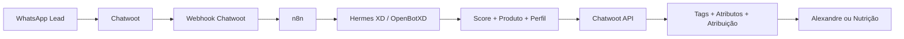

# Chatwoot + n8n + Hermes XD — Modelo próprio por API

> Modelo operacional para qualificação e roteamento de leads da HK Nove usando Chatwoot, n8n e Hermes XD/OpenBotXD, sem instalar plugin externo e sem alterar a infraestrutura do Chatwoot.

---

## Objetivo

Criar um funil comercial automatizado para leads imobiliários vindos do WhatsApp/Chatwoot.

O sistema deve:

- receber eventos do Chatwoot via webhook;
- interpretar mensagens do lead;
- classificar produto e perfil;
- calcular score comercial;
- aplicar tags e atributos no Chatwoot;
- mover o lead por etapas;
- acionar Alexandre quando o lead estiver quente;
- manter leads frios/mornos em nutrição automática.

---

## Arquivos deste projeto

- [[Arquitetura-Modelo-API]] — visão geral da arquitetura e fluxo.
- [[Workflow-n8n-Especificacao]] — desenho detalhado do workflow no n8n.
- [[Guia-Instalar-Workflow-n8n-Silent-v0]] — passo a passo para importar/testar o workflow silencioso.
- `workflow-chatwoot-hermes-silent-v0.json` — workflow importável no n8n, modo silencioso e classificação por regras.
- [[Funil-Tags-Score-HK-Nove]] — etapas, tags, score e gatilhos.
- [[Payloads-Chatwoot-API]] — payloads e chamadas API planejadas.
- [[Estado-Atual-Chatwoot]] — IDs reais da instância, inbox, agente, labels e atributos existentes.
- [[Credenciais-n8n-Chatwoot]] — credencial nativa Fazer.ai e credencial HTTP usada pelo workflow próprio.
- [[Setup-Criado-Chatwoot-2026-06-10]] — labels e atributos criados via API após aprovação.
- [[Setup-n8n-Importado-2026-06-10]] — workflow importado no n8n, credencial criada e estado do webhook atual.
- [[Seguranca-Webhook-n8n-2026-06-10]] — trava de assinatura, label `testando-agente` e webhook de teste criado no Chatwoot.
- [[Integracao-Kanban-Chatwoot-2026-06-10]] — board Kanban identificado e workflow atualizado para mover/atualizar cards.
- [[Incidente-Correcao-jsonBody-n8n-2026-06-10]] — correção do erro “Corpo JSON não é válido” nos nodes HTTP.
- [[Decisao-Cancelar-Cowork-FazerAI]] — decisão de não depender do `/desenhar-funil` e seguir com modelo próprio.
- [[Checklist-Implementacao]] — ordem segura para implementar.
- [[Hermes-XD-Prompt-Qualificacao]] — prompt base para classificação/score.
- `hermes-xd-classification.schema.json` — schema para validar a resposta JSON do Hermes no n8n.

---

## Decisão técnica

Não usar `curl | bash` de terceiros em produção.

Criar integração própria por API:

---

## Funil-base

1. Novo Lead
2. Atendimento Inicial
3. Qualificação
4. Produto Direcionado
5. Material Enviado
6. Reunião/Visita Agendada
7. Proposta/Negociação
8. Fechado
9. Perdido/Nutrição

---

## Regra central

- Hermes XD conduz etapas **1 a 5**.
- Alexandre assume obrigatoriamente a partir da etapa **6**.
- Alexandre também assume automaticamente se:
  - score ≥ 80;
  - lead pede tabela;
  - lead pede disponibilidade;
  - lead pergunta entrada/parcela;
  - lead pede proposta;
  - lead agenda reunião/visita;
  - lead demonstra urgência;
  - lead informa orçamento compatível.

---

## Produtos cobertos

- Hilton Garden Inn Residencial.
- Multipropriedade Hilton.
- Centro Médico Hilton.
- Lótus Business.
- The Spot One.

---

## Próxima ação

Implementar primeiro em modo teste:

1. Criar tags e atributos no Chatwoot.
2. Criar webhook do Chatwoot para n8n.
3. Montar workflow em n8n sem responder automaticamente.
4. Testar com conversas internas.
5. Ativar respostas e atribuições gradualmente.
