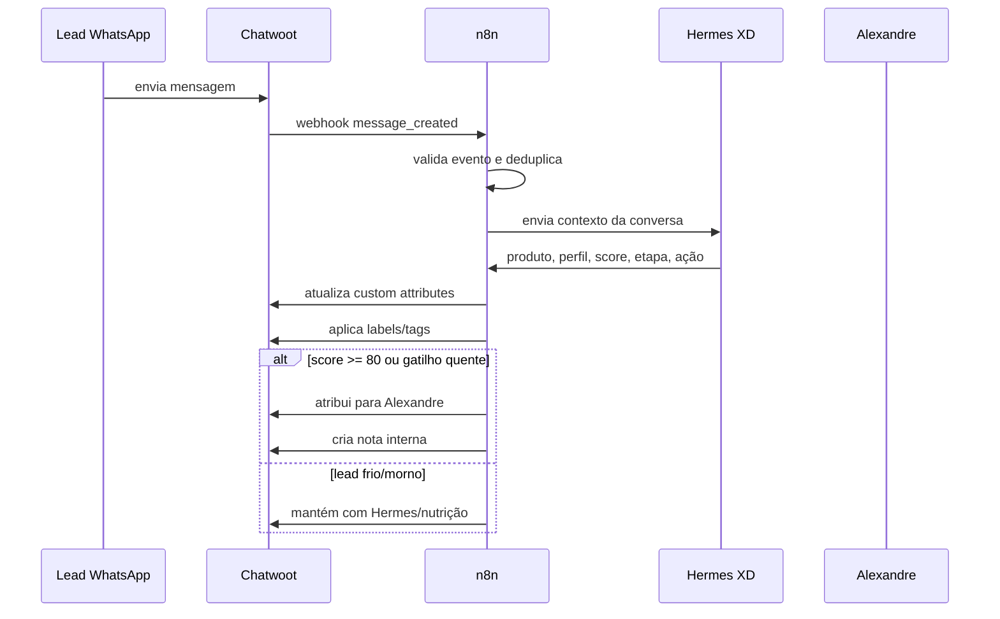

# Arquitetura — Modelo próprio por API

## Princípio

Criar uma automação comercial leve, controlada e reversível.

Não vamos:

- trocar imagem Docker do Chatwoot;
- instalar plugin externo no servidor;
- mexer no banco interno do Coolify;
- depender de marketplace para operar o funil.

Vamos usar:

- Webhooks nativos do Chatwoot;
- API do Chatwoot;
- workflow n8n;
- Hermes XD/OpenBotXD para qualificação e decisão comercial.

---

## Componentes

### 1. Chatwoot

Função:

- receber conversas do WhatsApp;
- armazenar histórico;
- exibir tags, atributos e status do lead;
- permitir atendimento humano quando necessário.

Uso planejado:

- Webhook para enviar eventos ao n8n.
- API para aplicar tags, atributos, mensagens internas e atribuição.

---

### 2. n8n

Função:

- receber evento do Chatwoot;
- normalizar payload;
- evitar duplicidade;
- chamar Hermes XD/OpenBotXD;
- aplicar score;
- atualizar Chatwoot;
- disparar follow-ups e nutrições.

---

### 3. Hermes XD / OpenBotXD

Função:

- interpretar intenção do lead;
- identificar produto ideal;
- detectar perfil;
- calcular score;
- sugerir próxima ação;
- produzir resposta segura, se aplicável.

---

## Fluxo principal

---

## Estratégia de funil dentro do Chatwoot

Chatwoot não precisa virar CRM completo.

Vamos representar o funil com:

1. **Custom attribute** `funil_etapa`.
2. **Label** `etapa_*`.
3. **Custom attribute** `lead_score`.
4. **Custom attribute** `produto_interesse`.
5. **Custom attribute** `perfil_lead`.
6. **Custom attribute** `proxima_acao`.
7. **Private note** com resumo para o vendedor.

---

## Por que não usar plugin externo agora

Risco do modelo `curl | bash`:

- executa código remoto direto no servidor;
- inclui credenciais temporárias/privadas;
- altera Coolify/Chatwoot em nível de infraestrutura;
- pode substituir imagem de serviço;
- aumenta dependência externa.

Modelo API é mais seguro:

- reversível;
- audível;
- sem alterar Docker/Coolify;
- fácil de pausar;
- evolui por workflow;
- controlado por Alexandre/OpenBotXD.

---

## Modo de implantação recomendado

### Fase 1 — Silenciosa

- n8n recebe eventos;
- classifica leads;
- aplica tags/atributos;
- cria notas internas;
- não envia mensagens automáticas ao cliente.

### Fase 2 — Assistida

- Hermes sugere resposta;
- Alexandre aprova/copiar-colar ou usa resposta sugerida;
- n8n continua classificando.

### Fase 3 — Automática controlada

- respostas automáticas apenas em etapas 1–3;
- handoff obrigatório em etapa 6 ou score 80+;
- pausas quando conversa for assumida por humano.

---

## Regra anti-conflito com humano

Se a conversa estiver atribuída a Alexandre ou outro humano e tiver atividade humana recente, o Hermes não deve enviar mensagem automática.

Ele pode apenas:

- atualizar score;
- adicionar nota interna;
- sugerir próxima ação.
